# Diagrama de Atividade com Swimlanes — Guia para draw.io

## Estrutura: 5 Barras Horizontais

Cada barra contém **apenas** as atividades executadas por esse grupo.  
As setas que cruzam barras representam mensagens FIPA-ACL entre agentes.

---

## Referência Mermaid (aproximação com subgraphs)

> ⚠️ Mermaid não suporta swimlanes nativamente. Este diagrama usa subgraphs
> como aproximação visual. No draw.io, desenhar com barras horizontais reais.

```mermaid
flowchart LR

    subgraph DOENTE["🧑 DOENTE (AgenteDoente)"]
        D_START([🟢 Chegada])
        D_TIPO{tipo_entrada?}
        D_SEND_C["📤 request/<br/>patient_request<br/>→ TriagemGeral"]
        D_SEND_N["📤 request/<br/>patient_request<br/>→ CoordConsultas"]
        D_SEND_U["📤 request/<br/>patient_request<br/>→ CoordTriagem"]
        D_WAIT["⏳ Aguardar<br/>notificação"]
        D_NOTIF["📩 Receber inform/<br/>consultation_scheduled"]
        D_ALTA["📩 Receber inform/<br/>discharge"]
        D_END([🔴 FIM — stop])
    end

    subgraph TRIAGEM["🏥 TRIAGEM (TriagemGeral + CoordTriagem + AgenteTriagem)"]
        T_RECV["📥 Receber<br/>patient_request"]
        T_DIAG["🔬 Diagnosticar<br/>especialidade +<br/>prioridade"]
        T_TIPO{tipo_original?}
        
        T_LB_FORK[["🔀 Fork"]]
        T_LB1["📤 cfp/load_query<br/>→ Supervisor H1"]
        T_LB2["📤 cfp/load_query<br/>→ Supervisor H2"]
        T_LB_JOIN[["🔀 Join"]]
        T_SELECT["🏥 Selecionar hospital<br/>menor specialty_load"]

        T_LOCAL["📥 Receber<br/>patient_request"]
        T_CFP_TRI["📡 Contract Net<br/>cfp/triage_cfp<br/>→ médicos + salas"]
        T_PROP_TRIAGE["📩 Recolher<br/>propose de médicos<br/>e salas"]
        T_ACC_TRIAGE["📨 accept-proposal<br/>→ médico + sala"]
        T_CLASSIFY["⚠️ Classificar<br/>urgência + prioridade"]
        T_REL_SALA["📤 inform/release<br/>→ Sala triagem"]
        T_SEND_URG["📤 request/<br/>triaged_patient<br/>→ CoordUrgências"]
    end

    subgraph COORD["📋 COORDENAÇÃO (5 Coordenadores)"]
        C_CONS_RECV["📥 Receber<br/>patient_request"]
        C_CONS_FILA["📋 Enqueue<br/>(fila por especialidade)"]
        C_CONS_SCHEDULE["🔍 Agendar slot<br/>(find + reserve<br/>médico + sala + turno)"]
        C_CONS_FORK[["🔀 Fork — accept-proposal"]]
        C_CONS_JOIN[["🔀 Join — reservation_confirmed"]]
        C_CONS_CONF{Ambos<br/>confirmaram?}
        C_CONS_NOTIF["📩 inform/<br/>consultation_scheduled<br/>→ Doente"]

        C_URG_RECV["📥 Receber<br/>triaged_patient"]
        C_URG_FILA["📋 enqueue<br/>(ordenar prioridade)"]
        C_URG_CFP["📡 Contract Net<br/>cfp/emergency_cfp<br/>→ médicos + salas"]
        C_URG_ACC["📨 accept-proposal<br/>→ Médico + Sala"]

        C_EXAM_RECV["📥 Receber<br/>exam_request"]
        C_EXAM_CFP["📡 Contract Net<br/>cfp/exam_cfp<br/>→ médico exame +<br/>equipamento"]
        C_EXAM_FORK_ACC[["🔀 Fork — Accept"]]
        C_EXAM_JOIN_CONF[["🔀 Join — Confirmação"]]
        C_EXAM_CONF{Ambos<br/>confirmaram?}
        C_EXAM_NOTIF["📩 inform/<br/>allocation_confirmed<br/>→ Solicitante"]

        C_CIR_RECV["📥 Receber<br/>surgery_request"]
        C_CIR_CFP["📡 Contract Net<br/>cfp/surgery_cfp<br/>→ cirurgião + bloco"]
        C_CIR_FORK_ACC[["🔀 Fork — Accept"]]
        C_CIR_JOIN_CONF[["🔀 Join — Confirmação"]]
        C_CIR_CONF{Ambos<br/>confirmaram?}
        C_CIR_NOTIF["📩 inform/<br/>allocation_confirmed<br/>→ Solicitante"]

        C_INT_RECV["📥 Receber<br/>internment_request"]
        C_INT_CFP["📡 Contract Net<br/>cfp/internment_cfp<br/>→ quartos + enfermeiros"]
        C_INT_FORK_ACC[["🔀 Fork — Accept"]]
        C_INT_JOIN_CONF[["🔀 Join — Confirmação"]]
        C_INT_CONF{Alocado?}
        C_INT_NOTIF["📩 inform/<br/>allocation_confirmed<br/>→ Solicitante"]
        C_INT_FALHA["❌ inform/<br/>internment_failed"]
    end

    subgraph RH["👨‍⚕️ RECURSOS HUMANOS (Médico + Enfermeiro)"]
        R_PROP_ROT["📩 Receber<br/>accept-proposal<br/>(consulta agendada)"]
        R_CONFIRM["📤 inform/<br/>reservation_confirmed"]
        R_AGUARD["⏳ Scheduled<br/>ConsultationBehaviour<br/>(aguardar hora)"]
        R_INICIA["🏥 Iniciar consulta"]
        R_AVALIA["🔬 EvaluatePatient<br/>Behaviour"]
        R_DECIDE{Decisão<br/>clínica}

        R_PROP_URG["📩 Receber<br/>accept-proposal<br/>(urgência)"]
        R_ATEND_URG["🏥 Atendimento<br/>urgência"]

        R_EXAM_ACC["📩 Receber<br/>accept-proposal<br/>(exame)"]
        R_EXAM_CONFIRM["📤 inform/<br/>reservation_confirmed"]
        R_EXEC_EXAM["🔬 ExecuteExam<br/>Behaviour"]
        R_EXAM_RESULT["📤 inform/<br/>exam_result"]
        R_EXAM_DECIDE{Recomenda<br/>cirurgia?}

        R_CIR_ACC["📩 Receber<br/>accept-proposal<br/>(cirurgia)"]
        R_CIR_CONFIRM["📤 inform/<br/>reservation_confirmed"]
        R_EXEC_CIR["🏥 ExecuteProcedure<br/>Behaviour"]
        R_CIR_RESULT["📤 inform/<br/>surgery_result"]

        R_INT_ACC["📩 Receber<br/>accept-proposal<br/>(internamento)"]
        R_INT_CONFIRM["📤 inform/<br/>reservation_confirmed"]
        R_EXEC_INT["🏥 ManageInternment<br/>Behaviour"]
        R_INT_DONE["📤 inform/<br/>internment_finished"]

        R_REQ_EXAM["📤 request/<br/>exam_request"]
        R_REQ_CIR["📤 request/<br/>surgery_request"]
        R_REQ_INT["📤 request/<br/>internment_request"]
        R_DISCHARGE["📤 inform/<br/>discharge → Doente"]
        R_RELEASE["📤 inform/<br/>release → Sala"]
    end

    subgraph INST["🏢 INSTALAÇÕES (AgenteSala)"]
        I_PROP_ROT["📩 Receber<br/>accept-proposal<br/>(slot marcado)"]
        I_CONFIRM["📤 inform/<br/>reservation_confirmed"]
        I_AGUARD["⏳ Scheduled<br/>RoomOccupation<br/>Behaviour"]
        I_OCUPAR["🔒 Sala ocupada<br/>disponivel=false"]
        I_LIBERTAR["🔓 Sala livre<br/>disponivel=true"]

        I_PROP_URG["📩 accept-proposal<br/>(urgência)"]
        I_OCUP_URG["🔒 Sala ocupada"]
        I_LIB_URG["🔓 Sala livre"]

        I_PROP_EXAM["📩 accept-proposal<br/>(exame/cirurgia)"]
        I_EXAM_CONFIRM["📤 inform/<br/>reservation_confirmed"]
        I_OCUP_PROC["🔒 Equipamento/<br/>Bloco ocupado"]
        I_LIB_PROC["🔓 Equipamento/<br/>Bloco livre"]

        I_PROP_INT["📩 accept-proposal<br/>(internamento)"]
        I_INT_CONFIRM["📤 inform/<br/>reservation_confirmed"]
        I_OCUP_INT["🔒 Quarto ocupado"]
        I_LIB_INT["🔓 Quarto livre"]
    end

    %% ═══ ROUTING INICIAL DO DOENTE ═══
    D_START --> D_TIPO
    D_TIPO -->|Central| D_SEND_C
    D_TIPO -->|Normal| D_SEND_N
    D_TIPO -->|Urgência| D_SEND_U

    D_SEND_C -.->|"request"| T_RECV
    D_SEND_N -.->|"request"| C_CONS_RECV
    D_SEND_U -.->|"request"| T_LOCAL

    T_RECV --> T_DIAG
    T_DIAG --> T_TIPO

    T_TIPO -->|Urgência| T_LOCAL
    T_TIPO -->|Normal| T_LB_FORK

    T_LB_FORK --> T_LB1
    T_LB_FORK --> T_LB2
    T_LB1 --> T_LB_JOIN
    T_LB2 --> T_LB_JOIN
    T_LB_JOIN --> T_SELECT
    T_SELECT -.->|"request"| C_CONS_RECV

    C_CONS_RECV --> C_CONS_FILA
    C_CONS_FILA --> C_CONS_SCHEDULE
    C_CONS_SCHEDULE --> C_CONS_FORK
    C_CONS_FORK -.->|"accept-proposal"| R_PROP_ROT
    C_CONS_FORK -.->|"accept-proposal"| I_PROP_ROT

    R_PROP_ROT --> R_CONFIRM
    I_PROP_ROT --> I_CONFIRM
    R_CONFIRM -.->|"inform"| C_CONS_JOIN
    I_CONFIRM -.->|"inform"| C_CONS_JOIN
    C_CONS_JOIN --> C_CONS_CONF
    C_CONS_CONF -->|Não/Timeout| C_CONS_FILA
    C_CONS_CONF -->|Sim| C_CONS_NOTIF
    C_CONS_NOTIF -.->|"inform"| D_NOTIF

    D_NOTIF --> D_WAIT

    R_CONFIRM --> R_AGUARD
    I_CONFIRM --> I_AGUARD
    R_AGUARD --> R_INICIA
    I_AGUARD --> I_OCUPAR
    R_INICIA --> R_AVALIA

    %% ═══ FLUXO URGÊNCIA ═══
    T_LOCAL --> T_CFP_TRI
    T_CFP_TRI --> T_PROP_TRIAGE
    T_PROP_TRIAGE --> T_ACC_TRIAGE
    T_ACC_TRIAGE --> T_CLASSIFY
    T_CLASSIFY --> T_REL_SALA
    T_REL_SALA --> T_SEND_URG
    T_SEND_URG -.->|"request"| C_URG_RECV
    C_URG_RECV --> C_URG_FILA
    C_URG_FILA --> C_URG_CFP
    C_URG_CFP -.->|"accept-proposal"| R_PROP_URG
    C_URG_CFP -.->|"accept-proposal"| I_PROP_URG
    R_PROP_URG --> R_ATEND_URG
    I_PROP_URG --> I_OCUP_URG
    R_ATEND_URG --> R_AVALIA

    %% ═══ DECISÃO CLÍNICA ═══
    R_AVALIA --> R_DECIDE
    R_DECIDE -->|"Alta simples"| R_RELEASE
    R_DECIDE -->|"Precisa exame"| R_REQ_EXAM

    R_RELEASE -.->|"inform/release"| I_LIBERTAR
    R_RELEASE -.->|"inform/release"| I_LIB_URG
    R_RELEASE --> R_DISCHARGE
    R_DISCHARGE -.->|"inform/discharge"| D_ALTA
    D_ALTA --> D_END



    %% ═══ FLUXO EXAME ═══
    R_REQ_EXAM --> R_RELEASE
    R_REQ_EXAM -.->|"request"| C_EXAM_RECV
    C_EXAM_RECV --> C_EXAM_CFP
    C_EXAM_CFP --> C_EXAM_FORK_ACC
    C_EXAM_FORK_ACC -.->|"accept-proposal"| R_EXAM_ACC
    C_EXAM_FORK_ACC -.->|"accept-proposal"| I_PROP_EXAM
    R_EXAM_ACC --> R_EXAM_CONFIRM
    I_PROP_EXAM --> I_EXAM_CONFIRM
    R_EXAM_CONFIRM -.->|"inform"| C_EXAM_JOIN_CONF
    I_EXAM_CONFIRM -.->|"inform"| C_EXAM_JOIN_CONF
    C_EXAM_JOIN_CONF --> C_EXAM_CONF
    C_EXAM_CONF -->|Não/Timeout| C_EXAM_RECV
    C_EXAM_CONF -->|Sim| C_EXAM_NOTIF
    C_EXAM_NOTIF -.->|"inform/allocation_confirmed"| R_PROP_ROT
    R_EXAM_CONFIRM --> R_EXEC_EXAM
    I_EXAM_CONFIRM --> I_OCUP_PROC
    R_EXEC_EXAM --> R_EXAM_RESULT
    R_EXAM_RESULT --> R_EXAM_DECIDE
    R_EXAM_RESULT -.->|"inform/release"| I_LIB_PROC

    R_EXAM_DECIDE -->|Não| R_DISCHARGE
    R_EXAM_DECIDE -->|Sim| R_REQ_CIR

    %% ═══ FLUXO CIRURGIA ═══
    R_REQ_CIR -.->|"request"| C_CIR_RECV
    C_CIR_RECV --> C_CIR_CFP
    C_CIR_CFP --> C_CIR_FORK_ACC
    C_CIR_FORK_ACC -.->|"accept-proposal"| R_CIR_ACC
    C_CIR_FORK_ACC -.->|"accept-proposal"| I_PROP_EXAM
    R_CIR_ACC --> R_CIR_CONFIRM
    R_CIR_CONFIRM -.->|"inform"| C_CIR_JOIN_CONF
    I_EXAM_CONFIRM -.->|"inform"| C_CIR_JOIN_CONF
    C_CIR_JOIN_CONF --> C_CIR_CONF
    C_CIR_CONF -->|Não/Timeout| C_CIR_RECV
    C_CIR_CONF -->|Sim| C_CIR_NOTIF
    C_CIR_NOTIF -.->|"inform/allocation_confirmed"| R_PROP_ROT
    R_CIR_CONFIRM --> R_EXEC_CIR
    R_EXEC_CIR --> R_CIR_RESULT
    R_CIR_RESULT --> R_REQ_INT
    R_CIR_RESULT -.->|"inform/release"| I_LIB_PROC

    %% ═══ FLUXO INTERNAMENTO ═══
    R_REQ_INT -.->|"request"| C_INT_RECV
    C_INT_RECV --> C_INT_CFP
    C_INT_CFP --> C_INT_FORK_ACC
    C_INT_FORK_ACC -.->|"accept-proposal"| R_INT_ACC
    C_INT_FORK_ACC -.->|"accept-proposal"| I_PROP_INT
    R_INT_ACC --> R_INT_CONFIRM
    I_PROP_INT --> I_INT_CONFIRM
    R_INT_CONFIRM -.->|"inform"| C_INT_JOIN_CONF
    I_INT_CONFIRM -.->|"inform"| C_INT_JOIN_CONF
    C_INT_JOIN_CONF --> C_INT_CONF
    C_INT_CONF -->|Não/Timeout| C_INT_FALHA
    C_INT_FALHA -.->|"inform"| R_DISCHARGE
    C_INT_CONF -->|Sim| C_INT_NOTIF
    R_INT_CONFIRM --> R_EXEC_INT
    I_INT_CONFIRM --> I_OCUP_INT
    R_EXEC_INT --> R_INT_DONE
    R_INT_DONE --> R_DISCHARGE
    R_INT_DONE -.->|"inform/release"| I_LIB_INT
```

---

## Guia Passo-a-Passo para draw.io

### Configuração Inicial
1. **Orientação**: Landscape (horizontal)
2. **5 barras horizontais** empilhadas verticalmente
3. Fluxo principal da **esquerda para a direita**
4. Usar cores diferentes por barra para facilitar leitura

### Barra 1 — 🧑 Doente (cor: azul claro `#E3F2FD`)

| # | Forma | Conteúdo | Ligações |
|---|---|---|---|
| 1 | ●→ Início | Doente Chega | → A2 |
| 2 | ◇ Decisão | `tipo_entrada?` | Central → A3 / Normal → A4 / Urgência → A5 |
| 3 | ▭ Ação | Enviar `request/patient_request` → TriagemGeral | ⤵ Triagem (seta cruzada) |
| 4 | ▭ Ação | Enviar `request/patient_request` → CoordConsultas | ⤵ Coordenação (seta cruzada) |
| 5 | ▭ Ação | Enviar `request/patient_request` → CoordTriagem | ⤵ Triagem (seta cruzada) |
| 6 | ▭ Ação | Aguardar notificação | ← Coordenação (seta cruzada) |
| 7 | ▭ Ação | Receber `inform/consultation_scheduled` | → A8 |
| 8 | ▭ Ação | Receber `inform/discharge` | → A9 |
| 9 | ●→ Fim | `stop()` | — |

### Barra 2 — 🏥 Triagem (cor: amarelo `#FFF9C4`)

| # | Forma | Conteúdo | Ligações |
|---|---|---|---|
| 1 | ▭ Ação | Receber `patient_request` | ← Doente |
| 2 | ▭ Ação | Diagnosticar especialidade + prioridade | → B3 |
| 3 | ◇ Decisão | `tipo_original?` | Normal → B4 / Urgência → B8 |
| 4 | ▭ Fork | `cfp/load_query` → Supervisor H1 + H2 | → B5 |
| 5 | ▭ Join | Recolher `propose/load_response` | → B6 |
| 6 | ▭ Ação | Selecionar hospital (menor `specialty_load`) | → B7 |
| 7 | ▭ Ação | Enviar `request/patient_request` → Coordenador | ⤵ Coordenação |
| 8 | ▭ Ação | Receber `patient_request` (CoordenadorTriagem) | → B9 |
| 9 | ▭ Ação | Contract Net: `cfp/triage_cfp` → médicos + salas | → B10 |
| 10 | ▭ Ação | Recolher `propose` de médicos + salas | → B11 |
| 11 | ▭ Ação | `accept-proposal` → melhor médico + sala | → B12 |
| 12 | ▭ Ação | Classificar urgência (prioridade + especialidade) | → B13 |
| 13 | ▭ Ação | `inform/release` → Sala triagem | → B14 |
| 14 | ▭ Ação | Enviar `request/triaged_patient` | ⤵ Coordenação |

### Barra 3 — 📋 Coordenação (cor: verde claro `#E8F5E9`)

**Sub-secção Consultas (esquerda):**

| # | Forma | Conteúdo |
|---|---|---|
| 1 | ▭ | Receber `patient_request` |
| 2 | ▭ | `add_pending_request()` (fila por especialidade) |
| 3 | ◇ | Hora dentro de janela rotina? |
| 4 | ▭ | `find_best_routine_slot()` |
| 5 | ◇ | Slot disponível? → Não: esperar |
| 6 | ▭ | `reserve_routine_slot()` |
| 7 | ▭ Fork | `accept-proposal` → Médico + Sala |
| 8 | ▭ Join | Aguardar `reservation_confirmed` de ambos |
| 9 | ◇ | Ambos confirmaram? → Não: cancelar → volta a C2 |
| 10 | ▭ | `inform/consultation_scheduled` → Doente |

**Sub-secção Urgências (centro-esquerda):**

| # | Forma | Conteúdo |
|---|---|---|
| 11 | ▭ | Receber `triaged_patient` |
| 12 | ▭ | `enqueue()` (ordenar por prioridade) |
| 13 | ▭ | Contract Net: `cfp/emergency_cfp` → médicos + salas |
| 14 | ▭ | `accept-proposal` → melhor Médico + Sala |

**Sub-secção Exames (centro):**

| # | Forma | Conteúdo |
|---|---|---|
| 15 | ▭ | Receber `exam_request` |
| 16 | ▭ | Contract Net: `cfp/exam_cfp` → médico exame + equipamento |
| 17 | ▭ Fork | `accept-proposal` → Médico + MCDT |
| 17a | ▭ Join | Aguardar `reservation_confirmed` de ambos |
| 17b | ▭ | `inform/allocation_confirmed` → Solicitante |

**Sub-secção Cirurgias (centro-direita):**

| # | Forma | Conteúdo |
|---|---|---|
| 18 | ▭ | Receber `surgery_request` |
| 19 | ▭ | Contract Net: `cfp/surgery_cfp` → cirurgião + bloco |
| 20 | ▭ Fork | `accept-proposal` → Cirurgião + Bloco |
| 20a | ▭ Join | Aguardar `reservation_confirmed` de ambos |
| 20b | ▭ | `inform/allocation_confirmed` → Solicitante |

**Sub-secção Internamento (direita):**

| # | Forma | Conteúdo |
|---|---|---|
| 21 | ▭ | Receber `internment_request` |
| 22 | ▭ | Contract Net Fase 1: `cfp` → quartos |
| 23 | ◇ | Quarto disponível? |
| 24 | ▭ | Contract Net Fase 2: `cfp` → enfermeiros |
| 25 | ◇ | Enfermeiro disponível? → Não: `inform/internment_failed` |
| 26 | ▭ | `accept-proposal` → Quarto + Enfermeiro |

### Barra 4 — 👨‍⚕️ Recursos Humanos (cor: laranja claro `#FFF3E0`)

| # | Forma | Conteúdo | Notas |
|---|---|---|---|
| 1 | ▭ | Receber `accept-proposal` (consulta) | ← Coordenação |
| 2 | ▭ | `inform/reservation_confirmed` | → Coordenação |
| 3 | ▭ | `ScheduledConsultationBehaviour` (aguardar hora) | ⏳ |
| 4 | ▭ | Iniciar consulta (`routine_started`) | |
| 5 | ▭ | `EvaluatePatientBehaviour` | Duração simulada |
| 6 | ◇ | Decisão clínica | Alta / Exame / Internamento |
| 7 | ▭ | `inform/release` → Sala | ⤵ Instalações |
| 8 | ▭ | `request/exam_request` → CoordExames | ⤵ Coordenação |
| 9 | ▭ | Receber `accept-proposal` (exame) | ← Coordenação |
| 10 | ▭ | `ExecuteExamBehaviour` | Duração simulada |
| 11 | ▭ | `inform/exam_result` | → Médico solicitante |
| 12 | ◇ | Recomenda cirurgia? | Sim / Não |
| 13 | ▭ | `request/surgery_request` → CoordCirurgias | ⤵ Coordenação |
| 14 | ▭ | `ExecuteProcedureBehaviour` | Duração simulada |
| 15 | ▭ | `inform/surgery_result` | |
| 16 | ▭ | `request/internment_request` → CoordInternamento | ⤵ Coordenação |
| 17 | ▭ | `ManageInternmentBehaviour` (Enfermeiro) | Duração simulada |
| 18 | ▭ | `inform/internment_finished` | |
| 19 | ▭ | `inform/discharge` → Doente | ⤵ Doente |

### Barra 5 — 🏢 Instalações (cor: cinza claro `#F5F5F5`)

| # | Forma | Conteúdo | Notas |
|---|---|---|---|
| 1 | ▭ | Receber `accept-proposal` (slot marcado) | ← Coordenação |
| 2 | ▭ | `inform/reservation_confirmed` | → Coordenação |
| 3 | ▭ | `ScheduledRoomOccupationBehaviour` | ⏳ |
| 4 | ▭ | `disponivel = false` / sala ocupada | |
| 5 | ▭ | Receber `inform/release` (consulta/emergência/triagem) | ← Rec. Humanos |
| 6 | ▭ | `disponivel = true` / sala livre | |

---

## Legenda de Setas para draw.io

| Estilo | Significado |
|---|---|
| **→ sólida** | Fluxo sequencial dentro da mesma barra |
| **⤵ tracejada** | Mensagem FIPA-ACL entre barras (cruzamento de swimlane) |
| **→ sólida grossa** | Fork/Join (paralelismo) |

## Cores das Performatives nas Setas Cruzadas

| Performative | Cor sugerida |
|---|---|
| `request` | 🔵 Azul |
| `cfp` | 🟣 Roxo |
| `propose` | 🟢 Verde |
| `accept-proposal` | 🟢 Verde escuro |
| `reject-proposal` | 🔴 Vermelho |
| `inform` | 🟡 Amarelo/Dourado |
| `cancel` | 🔴 Vermelho tracejado |
