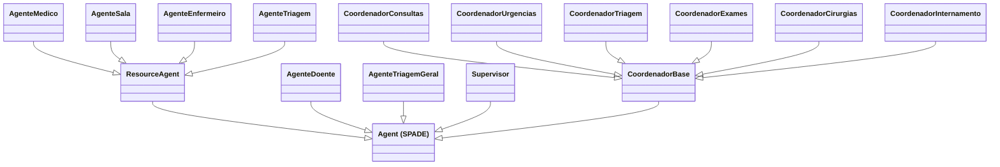

# Diagrama de Classes com Multiplicidade

```mermaid
classDiagram
    %% ═══ Classes Base ═══
    class Agent["Agent (SPADE)"]
    
    class ResourceAgent {
        +disponivel: bool
        +paciente_atual: str
        +weekly_hours_used: float
        +max_weekly_hours: float
        +on_shift: bool
        +current_assignment_type: str
        -_shift_type: str
        -_supervisor_jid: str
        +hospital_config: dict
        --
        +compute_shift_state() bool
        +sync_shift_state() bool
        +add_hours(procedure_type, hours)
        +clear_assignment()
        +build_status_payload() dict
        +build_status_message() Message
        +send_status(behaviour)
        +get_resource_name() str*
        --
        «behaviour» StartupStatusBehaviour
        «behaviour» ShiftRotationBehaviour
        «behaviour» WeeklyResetBehaviour
    }
    
    ResourceAgent --|> Agent
    
    %% ═══ Agentes Recurso ═══
    class AgenteMedico {
        +nome_medico: str
        +role: str = medic
        +sala_atual: str
        +mcdt_atual: str
        +bloco_atual: str
        +consult_mode: str
        +zone: str
        +specialty: str
        +agenda: dict
        +pending_exam_results: dict
        +pending_surgery_results: dict
        +next_routine_slot_at: float
        +emergency_callable: bool
        -_profile_cache: dict
        --
        +is_available_for_cfp() bool
        +build_proposal_body() dict
        +can_handle_cfp() bool
        +choose_exam_specialty() str
        +wait_for_result() dict
        +get_profile() dict
        -_compute_score() float
        --
        «behaviour» HandleProposalsBehaviour
        «behaviour» EvaluatePatientBehaviour
        «behaviour» ExecuteProcedureBehaviour
        «behaviour» ExecuteExamBehaviour
        «behaviour» ManageInternmentBehaviour
        «behaviour» ScheduledConsultationBehaviour
        «behaviour» ScheduledExamBehaviour
        «behaviour» ScheduledSurgeryBehaviour
    }
    
    class AgenteSala {
        +nome_sala: str
        +agenda: dict
        +next_routine_slot_at: float
        --
        «behaviour» HandleProposalsBehaviour
        «behaviour» ScheduledRoomOccupationBehaviour
    }
    
    class AgenteEnfermeiro {
        +nome_enfermeiro: str
        +role: str = nurse
        -_coord_int: str
        --
        +add_hours(procedure_type)
        --
        «behaviour» HandleProposalsBehaviour
        «behaviour» ManageInternmentBehaviour
    }
    
    class AgenteTriagem {
        +nome_medico: str
        +sala_triagem: str
        -_coord_urg: str
        -_supervisor: str
        --
        «behaviour» HandleTriagemBehaviour
        «behaviour» ClassifyUrgentPatientBehaviour
    }
    
    AgenteMedico --|> ResourceAgent
    AgenteSala --|> ResourceAgent
    AgenteEnfermeiro --|> ResourceAgent
    AgenteTriagem --|> ResourceAgent
    
    %% ═══ Agentes de Domínio ═══
    class AgenteDoente {
        +nome_doente: str
        +tipo_entrada: str
        +tipo_original: str
        +especialidade: str
        +hospital_config: dict
        --
        «behaviour» SendRequestBehaviour
        «behaviour» ReceiveStatusBehaviour
    }
    
    class AgenteTriagemGeral {
        +hospital_configs: list
        +pending_load_responses: dict
        -_sim_start_time: float
        --
        «behaviour» ReceivePatientsBehaviour
        «behaviour» DiagnoseAndRouteBehaviour
    }
    
    class Supervisor {
        -_hospital_id: int
        -_coord_cons: str
        -_coord_urg: str
        -_supervisor_name: str
        -_sim_start_time: float
        --
        «behaviour» MonitorBehaviour
        «behaviour» PeriodicDumperBehaviour
    }
    
    AgenteDoente --|> Agent
    AgenteTriagemGeral --|> Agent
    Supervisor --|> Agent
    
    %% ═══ Coordenadores ═══
    class CoordenadorBase {
        +pending_requests: list
        +pending_patient_ids: set
        -_coord_name: str
        -_supervisor: str
        +hospital_config: dict
        --
        +enqueue(data) bool
        +dequeue(doente_jid)
        +total_pending() int
        +get_ready_index() int
        +schedule_retry(data, max, base, cap)
        +reject_unselected(beh, props, sel, key, thread, motivo)
        +reject_all(beh, props, key, thread, motivo)
    }
    
    CoordenadorBase --|> Agent
    
    class CoordenadorConsultas {
        +resource_schedules: dict
        +pending_requests: dict «override»
        +alocacoes: dict
        +historico_alocacoes: list
        +pending_routine_patient_ids: set
        -_sim_start_time: float
        --
        +add_pending_request(data) bool
        +find_best_routine_slot(data) dict
        +reserve_routine_slot(jid, alloc)
        +get_routine_load_metrics() dict
        --
        «behaviour» CoordinatorBehaviour
    }
    
    class CoordenadorUrgencias {
        +allocated_urgency_patient_ids: set
        -_medicos: list
        -_salas: list
        --
        +enqueue(data) bool «override»
        +get_emergency_waitlist() list
        --
        «behaviour» EmergencyCoordinatorBehaviour
    }
    
    class CoordenadorTriagem {
        -_medicos_triagem: list
        -_salas_triagem: list
        -_coord_urg: str
        --
        «behaviour» TriageCoordinatorBehaviour
    }
    
    class CoordenadorExames {
        -_medicos: list
        -_equipamentos: list
        -_equipamentos_specialty: dict
        --
        «behaviour» ExamCoordinatorBehaviour
    }
    
    class CoordenadorCirurgias {
        -_medicos: list
        -_blocos: list
        --
        «behaviour» SurgeryCoordinatorBehaviour
    }
    
    class CoordenadorInternamento {
        -_internamento: list
        -_enfermeiros: list
        --
        «behaviour» InternamentoBehaviour
    }
    
    CoordenadorConsultas --|> CoordenadorBase
    CoordenadorUrgencias --|> CoordenadorBase
    CoordenadorTriagem --|> CoordenadorBase
    CoordenadorExames --|> CoordenadorBase
    CoordenadorCirurgias --|> CoordenadorBase
    CoordenadorInternamento --|> CoordenadorBase
    
    %% ═══ Relações de Hierarquia (Taxonomia) ═══
    ResourceAgent --|> Agent
    AgenteDoente --|> Agent
    AgenteTriagemGeral --|> Agent
    Supervisor --|> Agent
    CoordenadorBase --|> Agent

    AgenteMedico --|> ResourceAgent
    AgenteSala --|> ResourceAgent
    AgenteEnfermeiro --|> ResourceAgent
    AgenteTriagem --|> ResourceAgent

    CoordenadorConsultas --|> CoordenadorBase
    CoordenadorUrgencias --|> CoordenadorBase
    CoordenadorTriagem --|> CoordenadorBase
    CoordenadorExames --|> CoordenadorBase
    CoordenadorCirurgias --|> CoordenadorBase
    CoordenadorInternamento --|> CoordenadorBase
```

# Diagrama simplificado

```mermaid
classDiagram
    %% ═══ Classes Base ═══
    class Agent["Agent (SPADE)"]
    
    class ResourceAgent {
    }

    %% ═══ Agentes Recurso ═══
    class AgenteMedico {
    }
    
    class AgenteSala {
    }
    
    class AgenteEnfermeiro {
    }
    
    class AgenteTriagem {
    }
    
    
    %% ═══ Agentes de Domínio ═══
    class AgenteDoente {
    }
    
    class AgenteTriagemGeral {
    }
    
    class Supervisor {
    }
    
    
    %% ═══ Coordenadores ═══
    class CoordenadorBase {
    }
    
    
    class CoordenadorConsultas {
    }
    
    class CoordenadorUrgencias {
    }
    
    class CoordenadorTriagem {
    }
    
    class CoordenadorExames {
    }
    
    class CoordenadorCirurgias {
    }
    
    class CoordenadorInternamento {
    }
    
    CoordenadorConsultas --|> CoordenadorBase
    CoordenadorUrgencias --|> CoordenadorBase
    CoordenadorTriagem --|> CoordenadorBase
    CoordenadorExames --|> CoordenadorBase
    CoordenadorCirurgias --|> CoordenadorBase
    CoordenadorInternamento --|> CoordenadorBase
    
    %% ═══ Relações de Hierarquia (Taxonomia) ═══
    ResourceAgent --|> Agent
    AgenteDoente --|> Agent
    AgenteTriagemGeral --|> Agent
    Supervisor --|> Agent
    CoordenadorBase --|> Agent

    AgenteMedico --|> ResourceAgent
    AgenteSala --|> ResourceAgent
    AgenteEnfermeiro --|> ResourceAgent
    AgenteTriagem --|> ResourceAgent

```
