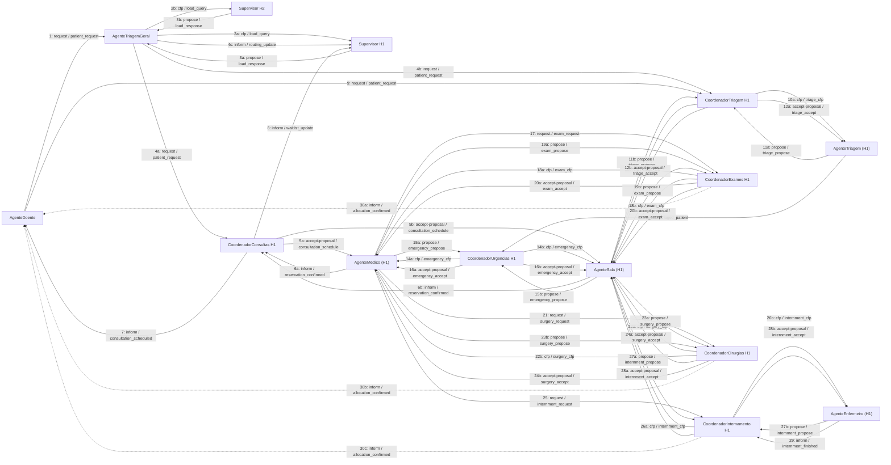

# Diagrama de Colaboração — Comunicação entre agentes (simplificado)

Este diagrama mostra as principais trocas de mensagens (cfp, request, propose, accept-proposal, inform) entre agentes do sistema.

